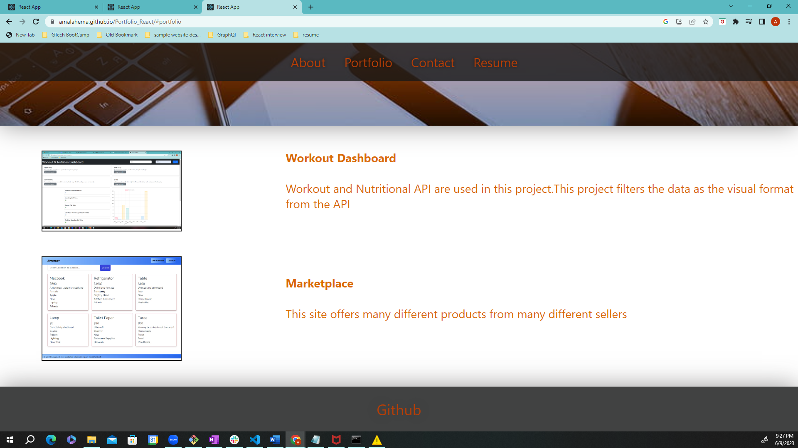
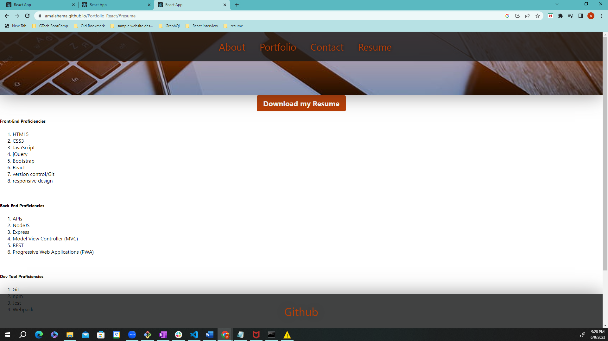
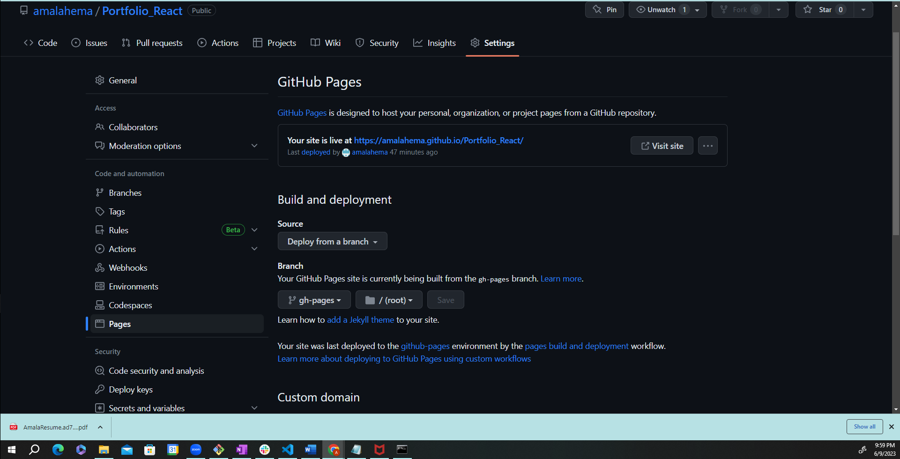
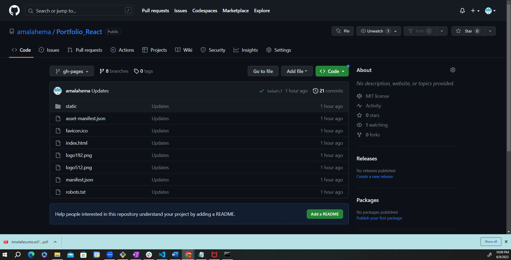

# 20 React: React Portfolio
## Table of contents
- Overview
    - The Challenge
    - Screenshot
    - Links
- My Approach
    - Code construction
    - Learnings
- Author
## Overview

## The Challenge

GIVEN a single-page application portfolio for a web developer
WHEN I load the portfolio
THEN I am presented with a page containing a header, a section for content, and a footer
WHEN I view the header
THEN I am presented with the developer's name and navigation with titles corresponding to different sections of the portfolio
WHEN I view the navigation titles
THEN I am presented with the titles About Me, Portfolio, Contact, and Resume, and the title corresponding to the current section is highlighted
WHEN I click on a navigation title
THEN I am presented with the corresponding section below the navigation without the page reloading and that title is highlighted
WHEN I load the portfolio the first time
THEN the About Me title and section are selected by default
WHEN I am presented with the About Me section
THEN I see a recent photo or avatar of the developer and a short bio about them
WHEN I am presented with the Portfolio section
THEN I see titled images of six of the developer’s applications with links to both the deployed applications and the corresponding GitHub repositories
WHEN I am presented with the Contact section
THEN I see a contact form with fields for a name, an email address, and a message
WHEN I move my cursor out of one of the form fields without entering text
THEN I receive a notification that this field is required
WHEN I enter text into the email address field
THEN I receive a notification if I have entered an invalid email address
WHEN I am presented with the Resume section
THEN I see a link to a downloadable resume and a list of the developer’s proficiencies
WHEN I view the footer
THEN I am presented with text or icon links to the developer’s GitHub and LinkedIn profiles, and their profile on a third platform (Stack Overflow, Twitter)

## Screenshot

### Links
Github URL:  https://github.com/amalahema/Portfolio_React

Delpyed URL: https://amalahema.github.io/Portfolio_React/

### Code Construction
- React,html,css
- useState
- we can add style in index.css

### Learnings
- index.js is the is the entry point of a React application that renders the root component (App) into the HTML element with the ID of 'root'.

- The root element is in the public folder index.html  

- App.js file represents a Single Page Application (SPA) structure using React.

- In this file, a main component called App serves as the entry point for your React application. 

- It imports several components such as About, Header, Footer, Resume, Portfolio, and Contact

- useState hook is used. The current page state variable is used to keep track of the currently active page/tab. The handlePageChange function is used to update the current page state.

- The renderPage function checks the value of currentPage and returns the corresponding component based on the active page. If the current page is "About," it renders the About component. Similarly, for other pages like "Contact," "Portfolio," or "Resume," the respective components are rendered. If none of the expected values are matched, it defaults to rendering the About component.

- The returned JSX structure in the return statement defines the layout of the SPA. It includes the Header component, the main element where the active page component is rendered using renderPage, and the Footer component.

- Overall, this App.js file demonstrates the structure and logic of a React SPA, where the content dynamically changes based on the selected page/tab.

- now using export default App other components can use the functionality of App.js

- Each component have own HTML structure and javascript function

- In JSX,(Java script xml) you can use curly braces {} to insert dynamic JavaScript expressions. These expressions can include variables, function calls, mathematical operations, and more. The content within the curly braces is evaluated as JavaScript and its result is rendered as part of the JSX output.

- To deploy react app in GitHub need to do the following steps:
    - First npm install gh-pages --save-dev
    - it installs the gh-pages library in node modules.
    - it is added as dev dependency in package.json.
    - second add this in  "homepage": "https://amalahema.github.io/Portfolio_React/",
    - third  add this  "pre-deploy": "npm run build",
    - "deploy": "gh-pages -d build" in scripts
    - now commit everything to the repo
    - Afterwards npm run deploy in the command prompt
- The gh-pages package is a tool used to deploy a static website to a GitHub Pages branch. When you run npm run deploy  with the appropriate configuration, it typically uses the gh-pages package to handle the deployment process.

- The deploy script in your package.json file is executed.

- The gh-pages command is invoked with the -d flag, followed by the path to the build directory. For example gh-pages -d build
- This tells gh-pages to publish the contents of the specified directory (build in this case) to the GitHub Pages branch.

- The gh-pages package creates a new branch (typically named gh-pages) in your repository if it doesn't already exist.

- The contents of the build directory (usually containing the compiled and optimized files of your React app) are copied to the gh-pages branch.

- The gh-pages branch is pushed to the remote repository on GitHub.

- Once the deployment process is completed, your React app will be accessible as a static website at the GitHub Pages URL associated with your repository.
When you run the deployment script using gh-pages (e.g., npm run deploy or yarn run deploy), the gh-pages package will automatically create the gh-pages branch if it doesn't already exist.

- The gh-pages branch is a special branch that GitHub Pages uses to serve your website's static content. The contents of the build directory (typically the build folder) are copied to this branch during deployment. Once the gh-pages branch is created and pushed to the remote repository, GitHub recognizes it as the source for your GitHub Pages site.

-  The gh-pages package simplifies the deployment process by automatically creating and updating the gh-pages branch for you. This allows you to easily deploy your React app or static website to GitHub Pages without having to manually create and manage the branch yourself.

- Now go to git repo you can  find gp-pages.

- Settings=>Pages=>select gp-page

- Now your react ready to deploy

- How run the page after update
  -   git add -A
  -   git commit -m "project 3 added to existing page"
  -   npm run build//to get the static files
  -   npm run deploy

